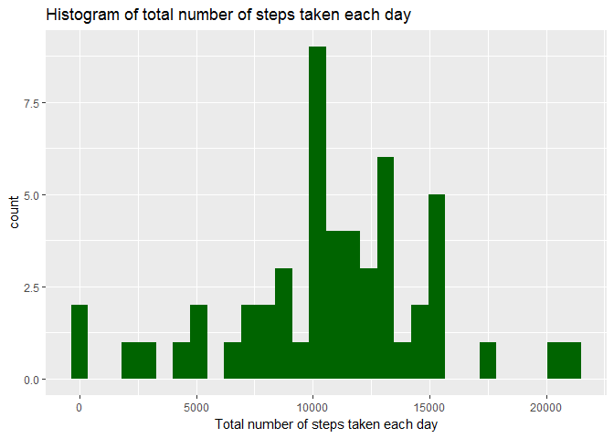
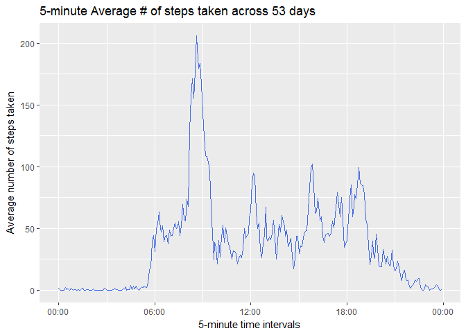
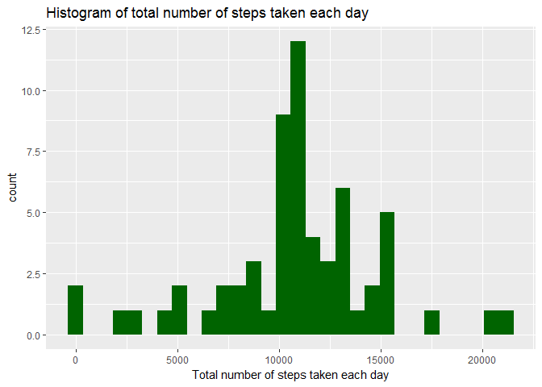
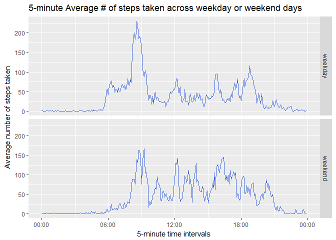

# Reproducible Research: Peer Assessment 1

Libraries used:

```r
library(lubridate)
library(dplyr)
library(ggplot2)
```

## Loading and preprocessing the data

```r
if(!file.exists("activity.csv")) {
    unzip("activity.zip")
}

rawActivities <- read.csv("activity.csv", stringsAsFactors = FALSE)
rawActivities$date <- ymd(rawActivities$date)

# Remove any NAs from steps
activities <- filter(rawActivities, !is.na(steps))
```


## What is mean total number of steps taken per day?

```r
# Calculate total steps per day
totalStepsPerDay <- activities %>%
    group_by(date) %>%
    summarise(totalSteps = sum(steps))

# Plot the histogram of total steps per day
ggplot(data = totalStepsPerDay, aes(totalSteps)) + 
    geom_histogram(bins = 30, fill = "darkgreen") +
    xlab("Total number of steps taken each day") +
    ggtitle("Histogram of total number of steps taken each day")
```

<!-- -->

```r
mean(totalStepsPerDay$totalSteps)
```

```
## [1] 10766.19
```

```r
median(totalStepsPerDay$totalSteps)
```

```
## [1] 10765
```


## What is the average daily activity pattern?

```r
# Average steps over all days by 5-minute time interval
avgStepsPerDay <- activities %>%
    group_by(interval) %>%
    summarise(avgSteps = mean(steps)) %>%
    arrange(interval)

numDays <- length(unique(activities$date))

# format the time
hhmmss <- formatC(avgStepsPerDay$interval * 100, width = 6, format = "d", flag = "0")
hhmmss <- as.POSIXct(fast_strptime(hhmmss, format = "%H%M%S"))

avgStepsPerDay$timeInterval <- hhmmss

# Which 5-minute interval, on average across all the days in the dataset, contains the maximum number of steps?
maxStepsTimeInterval <- avgStepsPerDay[which.max(avgStepsPerDay$avgSteps),"timeInterval"]

ggplot(data = avgStepsPerDay, aes(x = timeInterval, y = avgSteps)) +
    geom_line(colour = I("royalblue")) +
    scale_x_datetime(date_labels = "%H:%M") +
    xlab("5-minute time intervals") +
    ylab("Average number of steps taken") +
    ggtitle(paste("5-minute Average # of steps taken across", numDays, "days", sep = " "))
```

<!-- -->

Looking at the graph above, the **08:35** 5-minute interval has the **max** number of steps averaged across all days.


## Imputing missing values

Total number of rows with NAs: 2304


```r
# Impute NAs using Average Steps (over all days) Per interval

# Create a duplicate dataset
imputedActivities <- rawActivities

naRows <- is.na(imputedActivities$steps)

# Lookup the average steps using the interval of the rows where there are missing steps
matchedIndices <- match(imputedActivities[naRows,]$interval, avgStepsPerDay$interval)

# Replace the missing steps with the average steps for that same interval
imputedActivities[naRows,]$steps <- avgStepsPerDay[matchedIndices,]$avgSteps

# Calculate total steps per day
imputedTotalStepsPerDay <- imputedActivities %>%
    group_by(date) %>%
    summarise(totalSteps = sum(steps))

# Plot the histogram of total steps per day
ggplot(data = imputedTotalStepsPerDay, aes(totalSteps)) + 
    geom_histogram(bins = 30, fill = "darkgreen") +
    xlab("Total number of steps taken each day") +
    ggtitle("Histogram of total number of steps taken each day")
```

<!-- -->

```r
mean(imputedTotalStepsPerDay$totalSteps)
```

```
## [1] 10766.19
```

```r
median(imputedTotalStepsPerDay$totalSteps)
```

```
## [1] 10766.19
```
The **mean** total steps per day remains the **same** after imputing NAs, however the **median increased** from 10765 to 10766.19.
Imputing missing steps significantly increased the number of days where there were around 10,714 steps, however, the mean and median hardly changed.

## Are there differences in activity patterns between weekdays and weekends?

```r
# Create weekday/weekend factor
imputedActivities$dayFactor <-  factor(weekdays(imputedActivities$date) %in% c("Saturday", "Sunday"), 
                        levels = c("FALSE", "TRUE"), 
                        labels = c("weekday", "weekend"))

# Average number of steps by weekday and time interval
dayTypeAvgSteps <-  imputedActivities %>% 
    group_by(dayFactor, interval) %>%
    summarise(avgSteps = mean(steps))

# format the time
hhmmss <- formatC(dayTypeAvgSteps$interval * 100, width = 6, format = "d", flag = "0")
hhmmss <- as.POSIXct(fast_strptime(hhmmss, format = "%H%M%S"))

dayTypeAvgSteps$timeInterval <- hhmmss

ggplot(data = dayTypeAvgSteps, aes(x = timeInterval, y = avgSteps)) +
    facet_grid(dayFactor ~ .) +
    geom_line(colour = I("royalblue")) +
    scale_x_datetime(date_labels = "%H:%M") +
    xlab("5-minute time intervals") +
    ylab("Average number of steps taken") +
    ggtitle("5-minute Average # of steps taken across weekday or weekend days")
```

<!-- -->
The morning between 6am and 9am shows the biggest difference between weekday activities and weekend activities.
